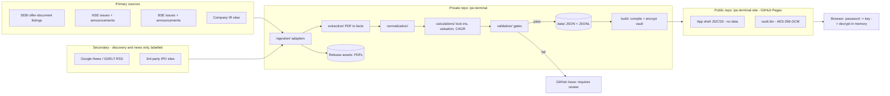

# India IPO Intelligence Terminal — Architecture Proposal (v0.1, for approval)

Prepared by Arham Saraogi · 5 Oct 2026 · Status: **approved 5 Oct 2026** — two-repo hosting, terminal-only alerts, code-only V1

Repository inspection: the `IPO Monitor` folder is empty and not yet a git repo, so this is a greenfield design. Local toolchain available: git, Node 22, Python 3.10 (CI will use Python 3.12).

---

## 0. Decisions that change your brief

| # | Brief said | Proposal | Why |
|---|---|---|---|
| D1 | Next.js | **React + Vite + TypeScript SPA, hash routing** | Password protection requires that *no* company data or page names exist in plain HTML. Next.js static export bakes data into per-page HTML; an SPA ships an empty shell and decrypts one data bundle in the browser. |
| D2 | One repo on GitHub | **Two repos**: `ipo-terminal` (private: code, data, pipeline) → `ipo-terminal-site` (public: GitHub Pages, ciphertext only) | GitHub Pages sites are always publicly reachable. Encryption protects the content; the private repo keeps raw JSON off the internet. Free plan works. |
| D3 | PDFs in `documents/` | **PDFs as GitHub Release assets** in the private repo; git holds metadata, SHA-256, and extracted page text | A DRHP is 10–40 MB; hundreds per year would bloat git past GitHub's limits within months. |
| D4 | Primary unit = IPO | **Primary unit = Company**; an IPO is one `Offering` (a company can later have FPO/QIP/OFS) | As your brief concludes. |
| D5 | Watchlist in browser storage | **Watchlist + Portfolio in the private repo** | News for holdings must be fetched by the server-side pipeline, so it has to know your holdings. |

---

## 1. System architecture



Pipeline order, every run: **discover → download → extract → normalise → derive → validate → diff → commit → build → encrypt → deploy.** A failed source never deletes data; a failed validation never commits.

---

## 2. Password protection (no password in code)

| Element | Design |
|---|---|
| Secret | Passphrase stored only as GitHub Actions secret `TERMINAL_PASSPHRASE` (private repo). Never in code, git history, or the public site. |
| Build | All data → one JSON → gzip → **AES-256-GCM**, key = **PBKDF2-SHA-256, 600,000 iterations**, random 16-byte salt and 12-byte IV per build → `vault.bin` |
| Browser | Login screen → WebCrypto derives the key → decrypts → data held in memory only. Wrong password = GCM auth failure; nothing to see. |
| Remember device | Optional: derived key kept as a *non-extractable* CryptoKey in IndexedDB; "Lock" button wipes it. |
| What is public | Only the generic app shell and an opaque blob. No company names, URLs, or routes. `robots.txt` disallow + `noindex`. |
| Rotation | Change the secret → next build re-encrypts → old password stops working. |
| Limitation | Ciphertext can be attacked offline, so strength = passphrase strength. Use 5+ random words. This is confidentiality, not multi-user auth. |

---

## 3. Directory tree (private repo)

```text
ipo-terminal/
├── schemas/                 # JSON Schema = single source of truth
│                            #  → Pydantic (Python) + TS types generated
├── rules/
│   ├── lockin.yaml          # SEBI ICDR lock-in rules, versioned by effective date
│   ├── event_types.yaml     # extensible event registry
│   └── news_classifier.yaml # keyword → category rules
├── data/
│   ├── companies/<company_id>/
│   │   ├── company.json     # identity, aliases, status
│   │   ├── offerings.json   # IPO/FPO/QIP structures (facts)
│   │   ├── facts.json       # financials, industry, operating stats
│   │   ├── documents.json   # registry: type, url, sha256, release asset, version chain
│   │   ├── events.jsonl     # append-only timeline
│   │   ├── lockins.json     # derived tranches
│   │   └── news.jsonl       # append-only news
│   ├── text/<doc_sha>/      # extracted page text (gz) for provenance + re-extraction
│   ├── changes/2026-10.jsonl
│   ├── review/              # open "requires review" items
│   ├── portfolio/holdings.json
│   ├── watchlist.json
│   └── index/               # aliases, CIN/ISIN/symbol lookup
├── src/
│   ├── pipeline/            # Python 3.12
│   │   ├── ingestion/       # one adapter per source
│   │   ├── extraction/      # sections, tables, numeric claims
│   │   ├── normalization/   # units, periods, entity resolution
│   │   ├── calculations/    # ratios, CAGR, valuation, lock-ins
│   │   ├── validation/
│   │   ├── news/
│   │   └── build/           # compile + encrypt vault
│   └── web/                 # React + Vite + TS + Tailwind
├── tests/ (pytest, fixtures = real DRHP pages) · src/web/tests (Vitest, Playwright)
├── .github/workflows/
├── docs/ (ARCHITECTURE, SOURCES, RUNBOOK) · README.md · CHANGELOG.md
```

---

## 4. Data schemas (core)

**Fact** — every material number, exactly as your brief, plus fields for auditability:

```json
{
  "fact_id": "abc-ltd:revenue_from_operations:FY2026:consolidated",
  "metric": "revenue_from_operations",
  "value": 1250.4, "unit": "INR crore", "period": "FY2026",
  "basis": "restated_consolidated",
  "kind": "reported",                       // reported | calculated
  "formula": null, "inputs": [],            // set when calculated
  "source": { "document_id": "abc-ltd:rhp:v1", "source_type": "RHP",
              "page": 183, "table": "Restated Statement of Profit and Loss",
              "url": "...", "sha256": "..." },
  "extraction": { "method": "table:pdfplumber", "extracted_at": "2026-10-05T06:10:00+05:30",
                  "extractor_version": "0.3.1", "confidence": "high" },
  "status": "ok",                           // ok | requires_review | superseded
  "supersedes": "abc-ltd:...:drhp:v1"
}
```

| Entity | Key fields | Notes |
|---|---|---|
| Company | `company_id` (stable slug), legal name, aliases[], CIN, ISIN, NSE symbol, BSE code, sector, industry, segment (Mainboard/SME), lifecycle (private / filed / listed), website, IR URL | Entity resolution: CIN → ISIN → PAN in DRHP → normalised name ("Private Limited/Ltd/Limited" stripped) → manual alias table. Merge = alias, never delete. |
| Offering | type (IPO/FPO/QIP/OFS), fresh issue, OFS, price band, lot, face value, pre/post shares, promoter % pre/post, anchor portion, BRLMs, registrar — each a Fact | Implied market cap / P/E / EV/EBITDA computed as `calculated` facts; P/E suppressed when PAT ≤ 0 with label "Not meaningful". |
| Document | type, url, filing date, download date, sha256, release asset, `version`, `previous_version` | Revised filing = new version; old one retained. |
| Event | `event_type`, `date`, `date_kind` (actual / scheduled / derived), offering_id, source, detected_at | Append-only. New types = add a line to `event_types.yaml`. |
| LockinTranche | holder category, shares, % post-issue equity, start date, expiry, rule_id + rule version, source | Derived; recomputed each run. |
| NewsItem | company_id, published_at, title, url, source, `tier` (official / media), category, dedupe hash | Official = exchange filing. |
| Change | entity, field, old → new, source, detected_at | Generated by diffing each run. Feeds "Recent Changes". |
| Holding | company_id, qty, avg cost, acquired date, route (allotment / market) | Drives the Portfolio panel and high-frequency news. |

---

## 5. Source-by-source ingestion plan

| Source | Gives us | Method | Cadence | Risk |
|---|---|---|---|---|
| SEBI — DRHP / RHP / prospectus listings, observation status | Earliest filing, document PDFs | HTML listing pages → PDF links | 3× daily | Layout changes → adapter snapshot tests |
| NSE — current/upcoming issues, issue info, anchor & basis-of-allotment notices, corporate announcements | Dates, price band, subscription, listing, filings | JSON endpoints with cookie warm-up | 3× daily; hourly for holdings in market hours | **NSE often blocks cloud IPs.** Mitigation: backoff + BSE fallback; optional self-hosted runner |
| BSE — public issues, SME platform, corporate announcements | Same, plus SME coverage | JSON API with Referer headers | Same | Header/anti-bot changes |
| Company IR pages | Anchor notices, results, presentations | Per-company configured URL + change hash | Daily (holdings/watchlist) | No standard format |
| Google News / GDELT RSS | Media news, Private → IPO intent | RSS by company name + aliases | 2-hourly holdings, daily others | Third-party; labelled "media", never a source for numbers |
| Third-party IPO sites | Discovery gap-filler only | Only if a primary source is missing; flagged | Daily | Never authoritative |

**Phase 2 starts with a spike:** prove each endpoint actually responds from a GitHub Actions runner before building on it. In a test from a cloud sandbox today, NSE and SEBI responded; BSE returned 403 without a full browser header set, so access is not guaranteed.

---

## 6. Event model

```text
DRHP filed → SEBI observation → RHP filed → Dates announced → Price band → Anchor allocation
→ Open → Close → Basis of allotment → Refund/demat credit → Listing
→ Anchor 50% unlock (30d) → Anchor 50% unlock (90d) → Pre-IPO unlock (6m)
→ Promoter excess unlock → Promoter minimum-contribution unlock → 1Y / 2Y anniversary
→ Post-listing: results, shareholding pattern, QIP/FPO/OFS, bulk/block deals, pledges
```

- `scheduled` dates (e.g. listing per T+3) become `actual` when a filing confirms them; the change is logged.
- Chronology validator: DRHP ≤ RHP ≤ Open ≤ Close ≤ Allotment ≤ Listing. Breaks are flagged, never auto-fixed.

---

## 7. Lock-in model

- Rules live in `rules/lockin.yaml`, **keyed by segment (Mainboard/SME) and effective date**, because SEBI has amended them several times (e.g. anchor lock-in moved to 50% at 30 days + 50% at 90 days for issues from April 2023; SME rules were revised in 2024–25).
- The engine uses the rule version in force **on the issue's opening date**. Each rule cites the ICDR regulation number; the exact current text is verified in Phase 7 before any expiry is published.
- Start date = **date of allotment**, not listing.
- Share counts: RHP/prospectus capital-structure tables + anchor allocation notice; checked against the first post-listing shareholding pattern.
- Urgency bands: >90d · 30–90d · 7–30d · <7d · Expired. Language is always "eligible for sale", never "will be sold".

---

## 8. Extraction strategy (code-first)

| Step | Tool | Output |
|---|---|---|
| 1. Split the document | PyMuPDF bookmarks + standard ICDR section headings (Summary of the Offer Document, Capital Structure, Objects of the Offer, Basis for Offer Price, Industry Overview, Restated Financial Information) | Page ranges per section |
| 2. Text | PyMuPDF; OCR fallback (ocrmypdf/Tesseract) only for image pages | `data/text/<sha>/p###.txt.gz` |
| 3. Tables | pdfplumber (camelot fallback) | Raw cell grids with page + bbox |
| 4. Financials | Template matcher for the summary restated-financials table (standardised by ICDR), then full P&L/BS/CF | Facts, `restated_consolidated` basis |
| 5. Industry | Regex extractor for every numeric claim in Industry Overview (value, unit, period, CAGR, share, "₹ tn", "mn tonnes") + rule-based metric mapper | Industry facts with page provenance |
| 6. Normalise | Lakh / million / crore / billion → crore; brackets → negative; FY labels; consolidated vs standalone | Comparable facts |
| 7. Validate | Section 9 checks | `ok` or `requires_review` |

**LLM use:** optional and off in V1. If enabled later (Anthropic API key as an Actions secret), it is used only for the plain-English business description and for mapping odd industry tables, and it must quote the page. It never supplies a number that code didn't find on a page.

---

## 9. Validation gates

| Check | Rule | Tolerance |
|---|---|---|
| P&L chain | EBITDA − D&A ≈ EBIT; EBIT − finance cost + other income ≈ PBT; PBT − tax ≈ PAT | 1% or ₹0.5 cr |
| Issue | Fresh + OFS = Total | ₹0.1 cr |
| Shares | Pre-issue + fresh shares = post-issue | Exact at the upper band |
| Ownership | Categories sum to 100% | ±0.1 pp |
| Dates | Chronology (Section 6) | Exact |
| Lock-ins | Expiry = start + rule period, rule version matches the issue date | Exact |
| Provenance | Every published Fact has document + page | Required |
| Regression | No Fact silently disappears between runs | Required |

Fail → data stays on a branch and a GitHub Issue "Requires review: <company>" is opened, with the page reference. A pass merges to `main`.

---

## 10. Portfolio & news (your addition)

- **Mark as investment:** a button in the terminal opens a pre-filled GitHub Issue (`portfolio: add ABC Ltd, qty, price`). A workflow parses it and commits `holdings.json`. This works from a phone, with no token in the browser. The watchlist works the same way.
- **Front page:** a Portfolio panel (holdings, cost, IPO price, last price, gain vs IPO, next event, next lock-in, unread news count) sits above the pipeline.
- **News tracking for holdings:** every exchange announcement on NSE + BSE (official tier, complete coverage), IR page changes, and media RSS (media tier, deduplicated by canonical URL + title similarity). Classified by rules into: results, lock-in, block/bulk deal, management change, order win, rating, litigation/regulatory, fund-raise, other. Hourly during market hours, 2-hourly otherwise.
- **Alerts (optional):** email or Telegram for holdings: new filing, price-band change, lock-in < 7 days, results.

---

## 11. Design system — "Liquid Glass", executive-readable

- **Glass for the frame, solid surfaces for data.** Nav, sidebars, cards, sheets and the login use translucent layers (`backdrop-filter: blur(24px) saturate(180%)`, hairline borders, specular top highlight, soft depth). Dense tables sit on near-opaque panels, because glass behind numbers hurts legibility.
- System font stack (`-apple-system, SF Pro, Inter`), tabular figures, a large base size (16–17 px, KPI tiles 32–40 px), generous spacing. Light and dark themes, plus a `prefers-reduced-transparency` fallback.
- Executive layer first (KPI tiles, Portfolio, "This week": opens, listings, unlocks), with drill-down to analyst tables, timelines and source-linked facts. Any number can be clicked to open its source → document → page.
- Stack: Tailwind, TanStack Table (sort/filter), Recharts, Fuse.js global search (name / symbol / BSE code / CIN / sector).

**Screens:** Dashboard · Portfolio · Pipeline · Upcoming · Recently Listed · Private → IPO · Lock-in Calendar · IPO Calendar · New Filings · Recent Changes · News · Needs Review · Company (Overview, IPO, Financials, Industry, Valuation inputs, Shareholding, Timeline, Lock-ins, Documents, News, Changes).

---

## 12. GitHub Actions

| Workflow | Trigger | Job |
|---|---|---|
| `discover.yml` | Cron 08:00 / 13:00 / 19:00 IST + manual | Sources → new documents/events → diff |
| `extract.yml` | New document registered | Download → Release asset → extract → validate |
| `news.yml` | Hourly 09–16 IST (holdings), 2-hourly otherwise | Announcements + RSS → news.jsonl |
| `portfolio.yml` | Issue labelled `portfolio` / `watch` | Update holdings / watchlist |
| `build-deploy.yml` | Push to `main` touching `data/` or `src/web/` | Derive lock-ins/valuation → tests → build → encrypt → push to the site repo |
| `ci.yml` | PR | pytest, vitest, schema checks, Playwright smoke test |

A `concurrency` group stops two runs from committing at once. Commits are made by a bot account, with messages like `data: ABC Ltd RHP filed; price band ₹425–450`. Deploying to the site repo uses a fine-grained token scoped to that repo only.

**Budget:** private repos get 2,000 free Actions minutes per month. The estimate is ~1,300–1,600: news ~700, discovery ~300, extraction/OCR ~300, builds ~100. It fits, but OCR-heavy months could exceed it, so news cadence is configurable.

---

## 13. Major technical risks

| Risk | Impact | Mitigation |
|---|---|---|
| NSE/BSE block GitHub runner IPs | No dates/announcements | Spike first; dual-exchange fallback; optional self-hosted runner on a home machine |
| DRHP layouts vary by merchant banker | Wrong/missed numbers | Section-anchored extraction, validation gates, review queue, real-page test fixtures |
| Lock-in rules change | Wrong unlock dates | Versioned rule file; issue-date-based selection; source citation |
| Entity duplicates (DRHP name vs listed name) | Split timelines | CIN-first resolution + alias index |
| Repo size | Slow clones, limits | PDFs as release assets; gzip text |
| Offline brute force of the vault | Data exposure | Long passphrase; PBKDF2 600k (Argon2id possible later) |
| Free-tier minutes | Pipeline pauses | Cadence config; caching; skip unchanged sources by ETag/hash |
| Market prices | Licensing/reliability | Delayed exchange quotes, labelled "delayed"; never mixed with filing data |

---

## 14. V1 vs later

| V1 (target: working end-to-end) | V2 | Later |
|---|---|---|
| Repos, schemas, password vault, glass UI shell | Full P&L/BS/CF extraction, ROE/ROCE, cash flow | Shareholding-pattern tracking each quarter |
| SEBI + NSE + BSE discovery, Mainboard + SME | Industry numeric extraction + company vs industry growth | QIP / FPO / preferential / buyback / pledge |
| Document registry + versioning | Private → IPO tracker with confidence labels | LLM business descriptions (page-quoted) |
| Summary-financials + offer-structure extraction with provenance | Telegram/email alerts | Bulk/block deals, insider trades |
| Event timeline, change detection, lock-in engine + calendar | Recently Listed with delayed prices | SQLite/DuckDB if data outgrows JSON |
| Portfolio + watchlist + exchange-announcement news for holdings | Media news + classifier tuning | |
| Validation gates, Actions automation, auto-deploy | | |

---

## 15. Build phases (each ends with tests, a build, inspected output and a commit)

1. Repos + schemas + sample data + encrypted-vault build + glass UI shell with login
2. Source spike + SEBI/NSE/BSE discovery adapters
3. Document ingestion + release-asset storage + versioning
4. Offer-document section splitter + summary-financials/offer-structure extraction
5. Normalisation + validation gates + review queue
6. Event timeline + change engine
7. Lock-in engine (rules verified against ICDR text)
8. Dashboard + Portfolio + calendars
9. Company pages with source drill-down
10. Actions automation + deploy
11. Hostile-analyst QA pass

---

## Update — 5 Oct 2026 (Phase 2 go-live)

| Change | Why |
|---|---|
| **One public repo** (`ipo-terminal-site`) replaces the two-repo design. Pipeline data is stored **encrypted** (same passphrase, IPOV1) on an orphan `state` branch that is force-pushed as a single commit each run. | No deploy token needed; public repos get unlimited Actions minutes, which allows a 15-minute refresh cadence; nothing readable is ever committed. |
| Pages deploys via `actions/deploy-pages` straight from the workflow. | No second repo, no PAT. |
| Holdings and watchlist live in the browser (export/import for other devices). | A public repo can't hold them; announcements are pulled for every listed company, so news coverage doesn't depend on holdings. |
| **Anchor Desk** added as the primary workflow. | The user's family office wants to get into anchor books, which means spotting offer documents on the day they are filed and reaching the lead manager early. |
| Sources live: SEBI offer-document listings, NSE offer-document register (Mainboard + Emerge SME), NSE issues and issue detail, NSE announcements, NSE holidays. | BSE (incl. BSE-SME-only issues) blocks cloud runners (HTTP 403, Akamai). This is a known gap. |
| Cover-page extraction (pp.1–3) of DRHP/RHP. It captures offer size and structure, ICDR eligibility route, anchor / pre-IPO placement flags, promoters, CIN, BRLM deal-team contacts, and the registrar. Downloads are length-verified, the text layer is stored for provenance, and a corrupted text layer is flagged `requires_review`. | Highest-value fields for an anchor investor, and deterministic because ICDR fixes the cover layout. |
